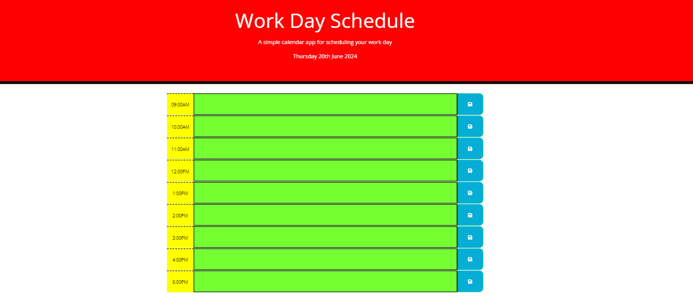
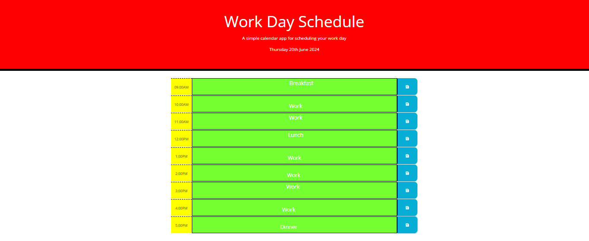
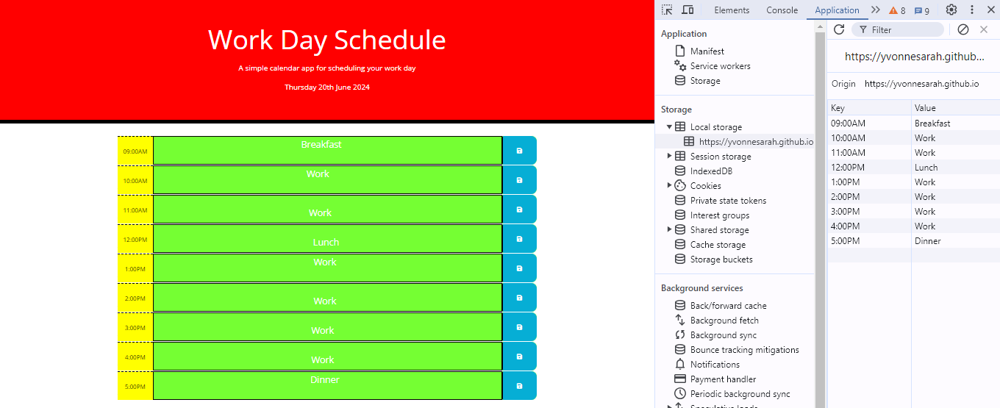

# Daily-Planner-App

## Description
A simple calendar application that allows a user to save events for each hour between 9am-5pm. It runs in the browser and feature dynamically updated HTML and CSS powered by jQuery. This app loops through the hours for a specific date, which is the current day that the user opens the app, uses moment.js to handle date. This application also allows the user to enter and save text into any description field, the data will be saved to the localStorage of the browser. The past hours are highlighted #75FF33, the present hour #ff6961, and future hours #FFBD33.

## Prerequisites
N/A

## Criteria
The app should:
* Display the current day at the top of the calendar when a user opens the planner.
* Present timeblocks for standard business hours when the user scrolls down.
* Color-code each timeblock based on past, present, and future when the timeblock is viewed.
* Allow a user to enter an event when they click a timeblock.
* Save the event in local storage when the save button is clicked in that timeblock.
* Persist events between refreshes of a page.
 
 ## Technologies Used
 Built with:
* HTML
* CSS
* JavaScript
* Bootstrap
* jQuery
* Moment.js
* fontawesome

## Installation
N/A

## Usage
N/A

## Project Link
Application can can be viewed here: 
* [Live](https://yvonnesarah.github.io/Daily-Planner-App/)

* [Repository](https://github.com/yvonnesarah/Daily-Planner-App)

## Screenshot(S)
Daily Planner App

Daily Planner App Schedule

Daily Planner App Local Storage

## Credit
N/A

## Licence
Please refer to the LICENSE in the repo.